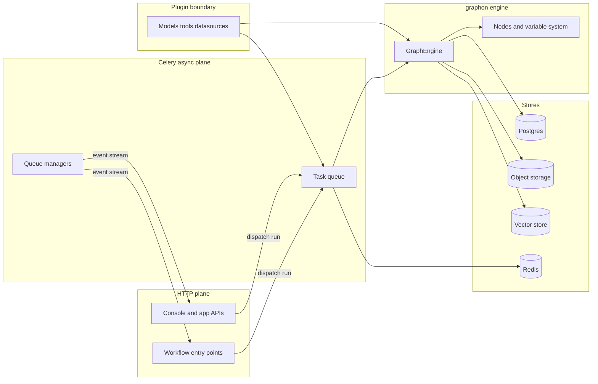

# The Big Picture

Dify is the platform layer for building LLM apps visually and serving them through API surfaces. It combines workflow, chatflow, agent, and completion apps around one execution model, grounds those apps in retrieval backed knowledge, and relies on a plugin ecosystem for models, tools, and datasources.

This page keeps the whole system in view before any subsystem dive. The aim is a mental model that explains what lives where, why the split exists, and which files carry the load when a run starts, pauses, or finishes.

## What Dify is for

At the product level, Dify turns visual app design into executable graphs that ground responses in knowledge and expose them through API driven delivery. The surface still presents as workflow, chatflow, agent, or completion app modes, but each mode feeds the same runtime and the same graph of steps.

## The domain object spine

The spine starts with `App` in `api/models/model.py` and `Workflow` in `api/models/workflow.py`. A workflow stores a JSON graph that the platform parses into a `Graph` of `Nodes`, then executes through `GraphEngine` over a `VariablePool`. Each run leaves `WorkflowRun` and `WorkflowNodeExecution` records, while chat shaped apps also create `Conversation` and `Message` rows. Every app mode under `api/core/app/apps/` converges on that same execution engine, even when the request enters through a different HTTP namespace.

## The engine lives outside this repository

The engine itself does not live in this repository. Graph execution, generic node types, the variable system, and the model runtime live in the first party package `graphon` at <https://github.com/langgenius/graphon>. Dify keeps the integration seam: `api/core/workflow/workflow_entry.py` provides `WorkflowEntry`, `api/core/workflow/node_factory.py` provides `DifyNodeFactory`, and `api/core/workflow/nodes/` holds Dify specific nodes such as `knowledge_retrieval`, `human_input`, `trigger_*`, and `agent`.

That split makes sense for a platform because it keeps execution semantics stable while app surfaces, node behavior, and product specific integration evolve around the boundary. For a deeper view of the engine boundary, see [Inside the graph engine](/02-inside-the-graph-engine.md).

## How the backend layers fit together

The `api/` tree follows a DDD and clean architecture shape. HTTP controllers sit at the edge in namespaces such as `console`, `web`, `service_api`, `inner_api`, `mcp`, `trigger`, and `files`; they hand off to services; services call into core and domain packages; and those packages persist through SQLAlchemy models that stay tenant scoped and form the system of record. The result keeps request handling, business rules, and persistence separated without hiding the flow of control.

## The async plane

Heavy work runs through Celery with Redis as broker. `api/celery_entrypoint.py` and `api/tasks/` move execution off the request path, and queue managers such as `api/core/app/apps/base_app_queue_manager.py` stream progress and output back over SSE. For the run lifecycle from dispatch to completion, see [Anatomy of a workflow run](/01-anatomy-of-a-workflow-run.md).

## Supporting cast

- The model runtime facade in `api/core/model_manager.py` keeps model access behind one surface; see [The model runtime](/06-the-model-runtime.md).
- `api/core/indexing_runner.py` and `api/core/rag/` handle retrieval ingestion and lookup; see [The RAG pipeline](/07-the-rag-pipeline.md).
- `api/core/tools/` gathers the tool integrations that graph nodes can call.
- `api/core/plugin/` supplies models, tools, and datasources through the plugin boundary; see [The plugin system](/08-the-plugin-system.md).
- `api/core/trigger/` provides event shaped entry points into the platform.

## Stores and infrastructure

Postgres, through SQLAlchemy, holds the durable application state, workflow state, and run records. Redis backs Celery and also carries cache and coordination data. `api/extensions/ext_storage.py` abstracts object storage, and `api/core/rag/datasource/vdb/vector_factory.py` routes requests to the chosen vector backend. Those choices keep the core platform portable while letting storage concerns vary by deployment.

## A dated edge of the repository

As of July 2026, the repository also carries young, actively churning subsystems: the next generation agent stack in `dify-agent/`, including the Go sandbox runtime in `dify-agent-runtime/`, and the Node CLI in `cli/`. This field guide does not cover those areas in depth.

## Where to look in the code

- `api/models/model.py` and `api/models/workflow.py` define the app and workflow records that anchor the platform.
- `api/core/app/apps/`, `api/core/workflow/workflow_entry.py`, `api/core/workflow/node_factory.py`, `api/core/workflow/nodes/`, `api/celery_entrypoint.py`, `api/tasks/`, and `api/core/app/apps/base_app_queue_manager.py` show the Dify side of the execution path.
- `graphon`: `src/graphon/graph_engine/graph_engine.py` and `src/graphon/graph_engine/worker.py` carry engine orchestration.
- `graphon`: `src/graphon/graph/graph.py` and `src/graphon/runtime/variable_pool.py` carry graph construction and variable storage.
- `api/core/model_manager.py`, `api/core/indexing_runner.py`, `api/core/rag/`, `api/core/plugin/`, `api/core/trigger/`, `api/extensions/ext_storage.py`, and `api/core/rag/datasource/vdb/vector_factory.py` map the supporting subsystems and stores.