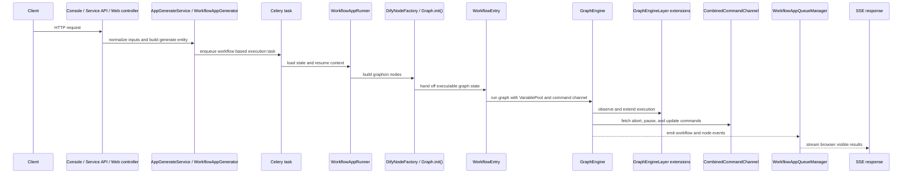

# Anatomy of a Workflow Run

## Overview

For product level setup and error handling context, see [Key concepts](https://docs.dify.ai/en/learn/key-concepts), [Workflow and chatflow](https://docs.dify.ai/en/cloud/use-dify/build/workflow-chatflow), and [Predefined error handling](https://docs.dify.ai/en/cloud/use-dify/build/predefined-error-handling-logic).

A workflow run begins as an HTTP request, but the request handler only validates the payload and creates the run description. The execution path then crosses a background boundary, enters graphon through `WorkflowEntry`, and returns state through a queue backed stream. The Dify repo owns the request, generator, queue, and persistence code under `api/`; the graphon repo owns the executable graph and engine under `src/graphon/`.

The controllers in `api/controllers/console/app/workflow.py`, `api/controllers/service_api/app/workflow.py`, and `api/controllers/web/workflow.py` all hand the request into `AppGenerateService.generate()`. `BaseAppGenerator._prepare_user_inputs()` in `api/core/app/apps/base_app_generator.py` normalizes the incoming values, converts files, and enforces the input shape before `WorkflowAppGenerator.generate()` or `AdvancedChatAppGenerator.generate()` packages the data into a generate entity. The handler stops there because it still needs a task id, queue ownership, and resume state before any worker can touch the run.

## Dispatch to background execution

`api/tasks/app_generate/workflow_execute_task.py` turns the generate payload into a Celery job and loads `_AppRunner`, which selects `WorkflowAppGenerator` or `AdvancedChatAppGenerator` after it restores the app, workflow, and user context. The payload keeps the fields that survive the handoff: `task_id`, `workflow_run_id`, `streaming`, `call_depth`, `root_node_id`, `invoke_from`, user identity, and normalized inputs. `AppQueueManager` in `api/core/app/apps/base_app_queue_manager.py` keeps task ownership in Redis, watches stop flags, and owns the local event queue. `WorkflowAppQueueManager` adds workflow specific wrapping in `WorkflowQueueMessage`, while `CombinedCommandChannel` and `CelerySignalCommandChannel` in `api/core/app/apps/workflow/command_channels.py` keep stop and shutdown control separate from node execution.

## Building the run and crossing the graphon seam

`WorkflowAppRunner` in `api/core/app/apps/workflow/app_runner.py` builds the runtime seam. It seeds `VariablePool` with system variables, bootstrap variables, and user inputs from `api/core/workflow/variable_pool_initializer.py`, then resolves the root node and prepares the `GraphRuntimeState`. From there, `WorkflowEntry` in `api/core/workflow/workflow_entry.py` carries the graph config, variable pool, command channel, and worker pool settings into graphon. `DifyNodeFactory` in `api/core/workflow/node_factory.py` becomes the handoff point where Dify turns its workflow description into executable graphon nodes, and `Graph.init()` in `src/graphon/graph/graph.py` validates those nodes and edges into a live graph. The seam matters because it lets Dify own node construction, variable seeding, and command wiring while graphon owns execution.

For the variable details behind that handoff, see [the variable system](./03-the-variable-system.md).

## Execution in graphon

`GraphEngine` in `src/graphon/graph_engine/graph_engine.py` runs the worker pool, dispatches commands, and emits graph and node events instead of returning a single result. `GraphEngineLayer` in `src/graphon/graph_engine/layers/base.py` gives Dify a controlled extension point, while `ExecutionLimitsLayer` and `DebugLoggingLayer` in graphon handle step and time limits plus debug visibility without changing core execution rules. The graph engine keeps the lifecycle moving until it emits a success, partial success, pause, or failure event.

## Cross cutting behavior via layers

The layer model keeps policy out of the engine core. `WorkflowEntry` attaches `WorkflowPersistenceLayer` from `api/core/app/workflow/layers/persistence.py`, `LLMQuotaLayer`, `ObservabilityLayer`, `build_workflow_agent_session_cleanup_layer()`, and any extra `GraphEngineLayer` instances that the caller passes in. Other Dify layers, such as `PauseStatePersistenceLayer`, `PauseStateLayer`, `SuspendLayer`, `TimesliceLayer`, `ConversationVariablePersistLayer`, and `TriggerPostLayer`, extend the same lifecycle without changing graphon itself. These layers handle persistence, pause state, quota control, observability, and trigger cleanup, so they act as extension points rather than core engine logic. The persistence and pause story continues in [pause, resume, and run state](./05-pause-resume-and-run-state.md).

## Events out to SSE

`iter_dify_graph_engine_events()` in `api/core/workflow/workflow_entry.py` filters graphon events into the response order that Dify promises. `WorkflowAppRunner._handle_event()` maps those events into Dify queue entities in `api/core/app/entities/queue_entities.py`, and `WorkflowAppQueueManager` keeps the queue open until a terminal workflow event arrives. `WorkflowAppGenerateResponseConverter` in `api/core/app/apps/workflow/generate_response_converter.py` then converts the queue output into blocking or streaming payloads, and `BaseAppGenerator.convert_to_event_stream()` turns those payloads into Server Sent Events for the browser. The client sees workflow lifecycle events, node lifecycle events, pause and retry events, chunk events, and human input events through that path, with the high level shapes defined in `api/core/app/entities/task_entities.py`.

## What is left behind

The durable record of the run lives in `WorkflowRun` and `WorkflowNodeExecutionModel` rows in `api/models/workflow.py`. Those rows carry the audit trail, status changes, timestamps, outputs, and node level results that later queries read back when the app shows run history or resumes a paused execution.

The `advanced_chat` variant follows the same engine path, but `api/core/app/apps/advanced_chat/` and `api/core/app/apps/message_based_app_generator.py` add conversation state around the run. `MessageBasedAppGenerator` creates `Conversation` and `Message` rows, and `AdvancedChatAppGenerator` keeps those records aligned while `api/tasks/app_generate/workflow_execute_task.py` starts, resumes, or fails the execution.

Trigger initiated runs enter through `api/core/trigger/constants.py` and `api/core/trigger/trigger_manager.py`, then pass through `TriggerWebhookNode` or `TriggerScheduleNode` before they reach the same workflow engine path. Those root nodes let webhook and schedule activity seed the run without changing the lifecycle that follows.

A `human_input` pause follows the same structure in reverse. `api/core/workflow/nodes/human_input/boundary.py` turns graph pause reasons into Dify pause reasons, and `PauseStatePersistenceLayer` preserves the resumption context so the run can continue later. See [pause, resume, and run state](./05-pause-resume-and-run-state.md) for the full pause and resume path.

## Where to look in the code

- `api/core/app/apps/workflow/app_generator.py`
- `api/core/workflow/workflow_entry.py`
- `api/core/workflow/node_factory.py`
- `api/tasks/app_generate/workflow_execute_task.py`
- `api/core/app/apps/workflow/app_queue_manager.py`
- `src/graphon/graph_engine/graph_engine.py`