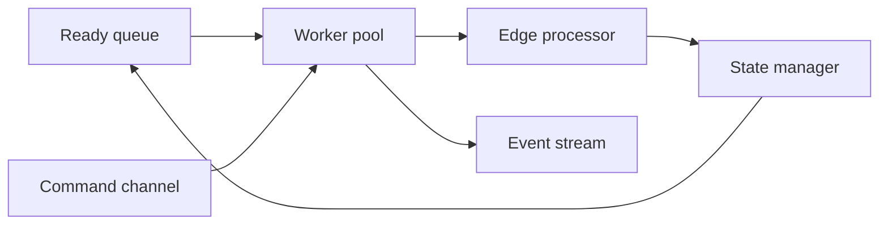

# Inside the Graph Engine

`GraphEngine` runs workflow execution as a queue-driven system. It seeds ready work, streams events back out, and lets Dify attach workflow-specific behavior through `api/core/workflow/workflow_entry.py` and the workflow runner stack. This page explains the queue life cycle, shared state, event flow, layer boundary, and failure handling that make that orchestration work.

## Mental model

`GraphEngine._start_execution()` seeds the root node into the ready queue, and `GraphStateManager.enqueue_node()`, `GraphStateManager.start_execution()`, and `GraphStateManager.finish_execution()` keep the queue life cycle explicit as work moves from waiting to active to complete. `WorkerPool` runs that work on threads instead of the call stack, so traversal stays separate from node execution.

## Edge processing

`EdgeProcessor.process_node_success()` advances the graph after a node succeeds. Non branch nodes mark every outgoing edge taken and let downstream nodes become ready only when `GraphStateManager.is_node_ready()` sees no unknown incoming edges and at least one taken edge. Branch nodes call `handle_branch_completion()`, keep the chosen handle, and send the unselected paths through `SkipPropagator.skip_branch_paths()`.

`SkipPropagator` stops at unknown incoming edges, keeps a node alive when any incoming edge stays taken, and marks the node skipped when all incoming edges stay skipped. That keeps joins tied to actual edge state instead of guessed control flow.

## Autoscaling worker pool

`WorkerPool` uses threads, not processes. It picks an initial worker count from graph size, then grows or shrinks at runtime with `check_and_scale()`. The pool scales up when ready queue depth rises above `scale_up_threshold` and the pool still sits below `max_workers`; it scales down when a worker stays idle for at least `scale_down_idle_time` seconds and the pool still sits above `min_workers`.

Dify sets `GRAPH_ENGINE_MIN_WORKERS = 3`, `GRAPH_ENGINE_MAX_WORKERS = 10`, `GRAPH_ENGINE_SCALE_UP_THRESHOLD = 3`, and `GRAPH_ENGINE_SCALE_DOWN_IDLE_TIME = 5.0` in `api/configs/feature/__init__.py`.

## State during the run

`GraphRuntimeState` carries the shared execution snapshot through the run: the `VariablePool`, outputs, execution context, pause data, and run-level bookkeeping. `VariablePool` gives nodes, layers, and command handlers one place to read and update workflow data, so retries, pauses, and child runs all see the same current state.

`GraphStateManager` owns node and edge state transitions, ready queue operations, and executing node bookkeeping. `ExecutionCoordinator` keeps the command processor, state manager, and worker pool in step. `GraphExecution` tracks workflow start, completion, pause, abort, errors, exceptions, and retries; `NodeExecution` tracks the per node execution id, retry count, state, and error text.

## Control from outside

The command channel protocol in `src/graphon/graph_engine/command_channels/protocol.py` gives `GraphEngine` a bidirectional control surface. `InMemoryChannel` serves single process runs with a thread safe queue; `RedisChannel` serializes commands into Redis for distributed control; and `CommandProcessor` polls the channel and dispatches `AbortCommand`, `PauseCommand`, and `UpdateVariablesCommand` to registered handlers.

Dify wraps a `RedisChannel` and a `CelerySignalCommandChannel` in `CombinedCommandChannel`, so ordinary commands and warm shutdown aborts reach the same engine instance. The `CelerySignalCommandChannel` emits one abort command when Celery warm shutdown starts.

## Events out

`GraphEngine.run()` yields a stream of `GraphEngineEvent` objects. `EventManager.emit_events()` drains the buffered event queue and streams those values out, while `EventHandler.dispatch()` turns node events into state transitions, traversal work, retries, and completion. In Dify, `WorkflowAppRunner._handle_event()` converts that engine stream into app-level queue events. The downstream queue path continues in [Anatomy of a workflow run](/01-anatomy-of-a-workflow-run.md).

## Layers

`GraphEngineLayer.initialize(read_only_runtime_state, command_channel)` names the binding point for each layer. `GraphEngine.layer()` applies that binding before execution begins, giving each layer a read-only runtime snapshot and the command channel without exposing mutable engine internals.

Dify uses that boundary in a few specific places. `WorkflowEntry` attaches `LLMQuotaLayer` and `ObservabilityLayer`; `WorkflowAppRunner` attaches `WorkflowPersistenceLayer`; and `WorkflowAppGenerator` attaches `PauseStatePersistenceLayer` when pause state configuration is present. The surrounding runner stack still adds session cleanup, suspension, conversation variable persistence, time slicing, and trigger bookkeeping where those concerns belong.

`WorkflowPersistenceLayer` saves workflow and node execution state, `ObservabilityLayer` opens spans, and `LLMQuotaLayer` checks and deducts tenant quota. `SuspendLayer` tracks paused state, `ConversationVariablePersistenceLayer` persists `conversation.*` updates, `PauseStatePersistenceLayer` saves the resume snapshot, `TimeSliceLayer` sends pause commands when the scheduler hits its limit, and `TriggerPostLayer` updates trigger logs when a run ends.

## Failure

`NodeRunFailedEvent` marks the worker fallback path when a node stops with an error. `EventHandler.dispatch()` sends that event to `ErrorHandler.handle_node_failure()`, which decides whether the run should retry, follow the fail-branch, fall back to a default value, or abort.

`Retry` requeues the node through `NodeRunRetryEvent`. `NodeRunExceptionEvent` carries the fail-branch and default-value outcomes forward, and the engine continues with the resulting outputs. If no strategy applies, the engine aborts the run. The downstream effects connect directly to [Parallel iteration and loops](/04-parallel-iteration-and-loops.md) and [Pause, resume, and run state](/05-pause-resume-and-run-state.md).

## Where to look in the code

- `graphon`: `src/graphon/graph_engine/graph_engine.py`, `worker.py`, `worker_management/worker_pool.py`
- `graphon`: `src/graphon/graph_engine/graph_traversal/edge_processor.py`, `skip_propagator.py`, `error_handler.py`
- `graphon`: `src/graphon/runtime/graph_runtime_state.py`, `variable_pool.py`, `graph_engine/domain/graph_execution.py`, `node_execution.py`
- `dify`: `api/core/workflow/workflow_entry.py`, `api/core/app/apps/workflow_app_runner.py`, `api/core/app/apps/workflow/app_runner.py`
- `dify`: `api/core/app/apps/workflow/command_channels.py`, `api/configs/feature/__init__.py`, `api/core/app/layers/*.py`, `api/core/app/workflow/layers/*.py`