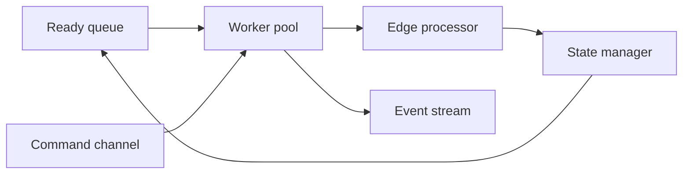

# Inside the Graph Engine

`GraphEngine` runs a workflow as a queue based system. It seeds ready work, hands nodes to worker threads, and turns each result into traversal and graph events. Dify wires that engine through `api/core/workflow/workflow_entry.py` and the workflow runner stack.

## Mental model

`GraphEngine` does not walk the graph by call stack. It seeds a ready queue, `GraphStateManager` marks nodes ready or taken, `WorkerPool` starts thread workers, and each `Worker` drains the ready queue, runs a node, and pushes node events into the event queue. `GraphEngine.run()` yields `GraphEngineEvent` values, while Dify bridges that stream into app queue events in `api/core/app/apps/workflow_app_runner.py` and `api/core/app/apps/workflow/app_runner.py`.

## Edge processing

`EdgeProcessor.process_node_success()` advances the graph after a node succeeds. Non branch nodes mark every outgoing edge taken and let downstream nodes become ready only when `GraphStateManager.is_node_ready()` sees no unknown incoming edges and at least one taken edge. Branch nodes call `handle_branch_completion()`, keep the chosen handle, and send the unselected paths through `SkipPropagator.skip_branch_paths()`.

`SkipPropagator` stops at unknown incoming edges, keeps a node alive when any incoming edge stays taken, and marks the node skipped when all incoming edges stay skipped. That keeps joins tied to actual edge state instead of guessed control flow.

## Autoscaling worker pool

`WorkerPool` uses threads, not processes. It picks an initial worker count from graph size, then grows or shrinks at runtime with `check_and_scale()`. The pool scales up when ready queue depth rises above `scale_up_threshold` and the pool still sits below `max_workers`; it scales down when a worker stays idle for at least `scale_down_idle_time` seconds and the pool still sits above `min_workers`.

Dify sets `GRAPH_ENGINE_MIN_WORKERS = 3`, `GRAPH_ENGINE_MAX_WORKERS = 10`, `GRAPH_ENGINE_SCALE_UP_THRESHOLD = 3`, and `GRAPH_ENGINE_SCALE_DOWN_IDLE_TIME = 5.0` in `api/configs/feature/__init__.py`.

## State during the run

`GraphRuntimeState` carries the live execution snapshot: the `VariablePool`, ready queue, execution context, outputs, token counts, pause bookkeeping, and serialized resume state. `VariablePool` stores values by selector and gives the engine one place to read and update workflow data.

`GraphStateManager` owns node and edge state transitions, ready queue operations, and executing node bookkeeping. `ExecutionCoordinator` keeps the command processor, state manager, and worker pool in step. `GraphExecution` tracks workflow start, completion, pause, abort, errors, exceptions, and retries; `NodeExecution` tracks the per node execution id, retry count, state, and error text.

## Control from outside

The command channel protocol in `src/graphon/graph_engine/command_channels/protocol.py` gives `GraphEngine` a bidirectional control surface. `InMemoryChannel` serves single process runs with a thread safe queue; `RedisChannel` serializes commands into Redis for distributed control; and `CommandProcessor` polls the channel and dispatches `AbortCommand`, `PauseCommand`, and `UpdateVariablesCommand` to registered handlers.

Dify wraps a `RedisChannel` and a `CelerySignalCommandChannel` in `CombinedCommandChannel`, so ordinary commands and warm shutdown aborts reach the same engine instance. The `CelerySignalCommandChannel` emits one abort command when Celery warm shutdown starts.

## Events out

`GraphEngine.run()` yields graph and node events as a stream. `WorkflowEntry.run()` filters that stream with `iter_dify_graph_engine_events()`, and `WorkflowAppRunner` turns each engine event into the app queue event that Dify consumers read. The downstream queue path continues in [Anatomy of a workflow run](/01-anatomy-of-a-workflow-run.md).