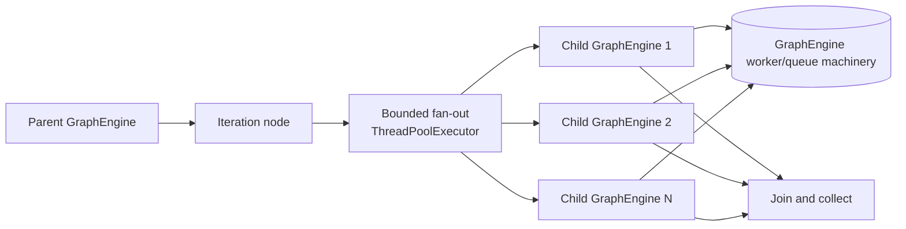

# Parallel Iteration and Loops

Iteration and loop nodes both look like repetition at the UI level, but they are executed as child graphs. The important model is not "a node with a body" but "a parent graph that spawns a child `GraphEngine` and then re-joins the child result." For configuration walkthroughs, see the official docs for [Iteration](https://docs.dify.ai/en/cloud/use-dify/nodes/iteration) and [Loop](https://docs.dify.ai/en/cloud/use-dify/nodes/loop); this page owns the execution semantics underneath them.

## Mental Model

An iteration node is a map over a collection. `IterationNode._create_graph_engine` deep-copies the current `VariablePool`, adds the current `index` and `item` under the iteration node's selector namespace, and hands that pool to a child `GraphEngine`. That child runs the iteration body as a real graph, emits its own graph events, and returns the chosen `output_selector` value back to the parent. The parent node then accumulates those per-item outputs and the child's `LLMUsage`, and it annotates iteration-scoped events with `ITERATION_ID` and `ITERATION_INDEX`.

A loop node is a different shape. `LoopNode` repeats the same child graph for a fixed `loop_count`, evaluates `break_conditions` before the loop starts and again after each round, and threads loop-scoped variables through the run. Its events carry `LOOP_ID` and `LOOP_INDEX`, and the terminal reason is recorded as `loop_break` or `loop_completed`. The loop body is therefore not a collection map; it is bounded re-entry into the same body until a condition or count stops it.

## Iteration vs Loop

The distinction matters because the two nodes answer different questions. Iteration asks, "How do these N inputs fan out to N child runs?" Loop asks, "How many times should this body repeat before a break condition ends it?" In `graphon`, iteration is shaped around `iterator_selector`, while loop is shaped around `loop_count`, `break_conditions`, and `loop_variables`.

That difference shows up in state handling. Iteration deep-copies the variable pool per item, so each child starts from an isolated snapshot plus its own `index` and `item`. Loop does not make that copy by default; `LoopNode._create_graph_engine` calls `create_child_engine` without a replacement pool, so the child builder falls back to the parent's pool. The loop node compensates by clearing variables from the loop subgraph before each round so stale values do not leak forward.

## Parallel Mode

Parallel iteration does not mean "the body becomes magically asynchronous." In code, `IterationNode` uses a `ThreadPoolExecutor`, bounded by `min(self.node_data.parallel_nums, len(iterator_list_value))`. That means `parallel_nums` is a cap on how many item runs may be in flight at once; the default is 10. Items beyond that limit wait in the executor until a worker slot opens. The node still emits `IterationNextEvent` for each item as it submits work, so the run can show queued fan-out even before every child has finished.

The important point is the boundary between the outer fan-out and the child graph itself. The outer layer decides how many child runs are launched concurrently; the child `GraphEngine` then executes its own queue/worker path as described in [02-inside-the-graph-engine.md](/02-inside-the-graph-engine.md). Parallel mode is therefore a bounded fan-out over child graphs, not a different execution substrate.

## Ordering and Joining

Parallel execution keeps output order stable by indexing, not by completion time. `IterationNode._execute_parallel_iterations` pre-sizes the output list with `None`, stores each child result back at the original input index, and collects results from the futures as they finish. So the output collection preserves input order even if the child runs complete out of order. The join happens when all futures have been drained and `_finalize_parallel_outputs` has had a chance to compact the list if needed.

The same rule is visible in the event model. The iteration lifecycle has started, next, succeeded, and failed event shapes in `graph_events/iteration.py`, and the loop lifecycle mirrors that in `graph_events/loop.py`. Those event classes are the code's record of "spawned," "advanced," "finished," and "failed," even when the actual body ran in child engines.

Iteration also has a small post-processing step on the collected outputs: if `flatten_output` is enabled and every non-`None` result is itself a list, the node flattens the nested lists into a single array. Otherwise, it leaves the output structure alone.

## Error Semantics

The error mode is a trade-off between fail-fast behavior, positional fidelity, and result density.

- `terminated` stops the run on the first failure. In sequential mode, the node raises `IterationNodeError`. In parallel mode, pending futures are cancelled and the iteration as a whole fails. This is the strictest option.
- `continue-on-error` preserves the shape of the result collection by leaving a `None` slot for the failed item. That keeps input positions aligned with output positions, which is useful when order matters more than density.
- `remove-abnormal-output` prefers a dense result array. In sequential mode it skips appending the failed result; in parallel mode it leaves a `None` placeholder until `_finalize_parallel_outputs` removes failed slots at the end.

Loop error handling is similar in spirit but not identical in mechanics. A failed loop round still flows through loop-scoped failure events, and the terminal reason is recorded separately from the fixed-count completion path. The key distinction is that loop failure is about repeated re-entry into one body, while iteration failure is about one item in a collection.

## Nesting and Limits

Child graphs can themselves contain child graphs, so nested iteration and loop nodes are literally engines inside engines. `WorkflowEntry.__init__` enforces the top-level guard by rejecting a `call_depth` greater than `dify_config.WORKFLOW_CALL_MAX_DEPTH`. That guard is in the Dify layer, not in the node code, which makes nested repetition a workflow-level concern rather than a single-node quirk.

The Dify child-engine builder is intentionally narrow. `build_child_engine` creates a fresh `GraphRuntimeState`, preserves the parent execution context, and explicitly attaches `LLMQuotaLayer`. The parent entry path can add `DebugLoggingLayer`, `ExecutionLimitsLayer`, and `ObservabilityLayer`, but those are not added again inside `build_child_engine`, and the code does not introduce a pause or persistence layer there either. In other words, child engines are run with the child-safe pieces the builder chooses, not with a wholesale copy of every parent extension. For pause, resume, and persistence details, see [05-pause-resume-and-run-state.md](/05-pause-resume-and-run-state.md).

## A small honesty note

The most surprising asymmetry in the code is that iteration and loop treat variable-pool isolation differently. Iteration deep-copies the pool per item; loop reuses the parent's pool unless a caller explicitly provides a replacement. That is the clearest signal that the two nodes are similar in shape but not in state semantics.

## Where to Look in the Code

- `dify/api/core/workflow/workflow_entry.py` — child-engine construction, call-depth guard, and Dify-side layer selection.
- `graphon/src/graphon/nodes/iteration/iteration_node.py` — iteration fan-out, ordering, join behavior, output flattening, and error modes.
- `graphon/src/graphon/nodes/loop/loop_node.py` — loop repetition, break checks, loop-variable handling, and carried state.
- `graphon/src/graphon/runtime/graph_runtime_state.py` — `create_child_engine` and runtime-state delegation.
- `graphon/src/graphon/graph_engine/graph_engine.py` and `graphon/src/graphon/graph_engine/worker_management/worker_pool.py` — queue/worker execution architecture for child graphs.
