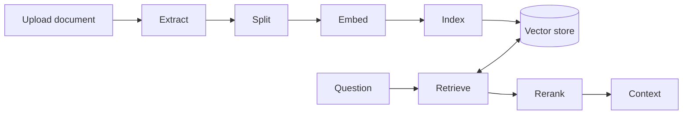

# The RAG Pipeline

## Overview

This page maps the path from document upload to retrieval inside a running app. The official knowledge docs cover setup and usage; this page focuses on the design that sits underneath them, with the Dify-side code in `api/` and the RAG subsystem in `api/core/rag/`. For usage and configuration follow-up, see [the official knowledge docs](https://docs.dify.ai/en/cloud/use-dify/knowledge/readme).

`Dataset`, `Document`, and `DocumentSegment` form the core storage model. `Dataset` carries tenant, retrieval, indexing, and pipeline metadata; it does not carry chunk text or vectors. `Document` records one source item plus its lifecycle timestamps from parsing through completion, and it keeps the source, process rule, and document shape attached to that item. `DocumentSegment` carries the chunk text itself, the segment status, hit counts, and the vector index node identity that retrieval uses later. `ChildChunk` narrows that same pattern for hierarchical indexing: it stores smaller child text under a parent segment so retrieval can work on smaller units without losing the parent container. `DatasetProcessRule` stores the segmentation rule set and supports `automatic`, `custom`, and `hierarchical` modes. `DatasetKeywordTable` stores the keyword sidecar used by keyword search, `Pipeline` binds a dataset to a workflow pipeline through `workflow_id`, and `DocumentPipelineExecutionLog` records the datasource, datasource payload, source node, and input snapshot for each run.

The code splits structure and cost into two separate decisions. `IndexStructureType` uses `text_model`, `qa_model`, and `hierarchical_model` to describe how the system breaks content into retrieval units. `IndexTechniqueType` uses `economy` and `high_quality` to describe how Dify pays for indexing.

## Ingestion as staged work

`IndexingRunner.run()` follows a three stage path: extract, transform, and load. It re-queries the document in the current session, loads the process rule, chooses an index processor from `doc_form`, and commits after extraction and again after segment creation so the next worker session can see the rows it needs. The runner keeps the slow work out of the request thread and onto the worker/Celery-style async plane described in [the big picture](./00-the-big-picture.md), and each stage boundary is where the database state must become durable before the next step starts.

Extraction turns the datasource into raw text. Transform cleans that text and splits it into indexed segments. Load writes `DocumentSegment` rows, marks them as indexing, and then hands the chunks to the vector store or keyword table path.

The economy path keeps cost low by indexing keywords only. In paragraph indexing, it calls `Keyword(dataset)` instead of vector creation, and query time later uses `KEYWORD_SEARCH`. The high quality path pays the embedding cost and writes vectors, which gives semantic retrieval later; `IndexingRunner` parallelizes chunk loading with a thread pool to reduce contention, and the parent child path writes child chunks into the vector store while the parent segment keeps the broader context.

QA indexing follows the same split, but it turns source text into question and answer pairs before load. That path only accepts `high_quality`, because the questions need vector indexing to work as intended.

## Chunking and segmentation

`TextSplitter` and `FixedRecursiveCharacterTextSplitter` split on separators, then recurse until chunks fit the target size while preserving overlap. That design keeps semantic boundaries when possible, but it still falls back to smaller pieces when a section runs long. Smaller chunks improve recall because the retriever can land on the exact passage; larger chunks preserve context but dilute the signal. Parent child indexing uses that tradeoff explicitly: the parent chunk gives the user or reranker broader context, while `ChildChunk` records smaller child pieces for retrieval and lets the system search them without making the visible parent chunk tiny.

## Vector store abstraction

`BaseVector` defines the storage contract: create or add texts, search by vector or full text, delete by ids or metadata, and delete a collection. `Vector` resolves the backend from the dataset's `index_struct` first, then from `dify_config.VECTOR_STORE`, and the whitelist can force `tidb_on_qdrant` for a tenant. `vector_backend_registry.py` loads backend factories from the `dify.vector_backends` entry point group, with built in fallback only when the workspace package does not register one. That pluggable layer lets Dify keep the retrieval contract stable while deployments choose Qdrant, Milvus, Pgvector, Weaviate, Elasticsearch, Chroma, or another store that fits their constraints.

## Retrieval at query time

`RetrievalMethod` names the supported search shapes: `semantic_search`, `full_text_search`, `hybrid_search`, and `keyword_search`. `DatasetRetrieval.knowledge_retrieval()` first checks rate limits and dataset availability, then resolves metadata filters, and finally chooses between `single_retrieve()` and `multiple_retrieve()`. Single dataset retrieval lets a router pick one dataset with `ReactMultiDatasetRouter` or `FunctionCallMultiDatasetRouter`, then applies that dataset's retrieval config. Economy datasets always force `KEYWORD_SEARCH`; high quality datasets honor the configured search method and then pass results through `DataPostProcessor`, which chooses either `RerankMode.RERANKING_MODEL` or `RerankMode.WEIGHTED_SCORE` and can apply a reorder pass. The model based branch asks `ModelManager` for a `ModelType.RERANK` instance, so reranking follows the same model runtime boundary described in [the model runtime](./06-the-model-runtime.md).

Multiple dataset retrieval runs each dataset in parallel threads, then merges the result set, sorts by score, and deduplicates Dify documents by `doc_id` before returning context. When the dataset list mixes indexing techniques, the code requires the rerank model path; weighted scoring also requires the same embedding model and provider across the set.

## Where retrieval plugs into apps

`KnowledgeRetrievalNode` reads query and attachment selectors from the `VariablePool`, builds a `KnowledgeRetrievalRequest`, and hands it to `DatasetRetrieval`. The node returns an `ArrayObjectSegment` named `result`, which downstream nodes can read from the workflow state just like any other variable. The agent tool path uses `DatasetRetrieverTool` for a single dataset and `DatasetMultiRetrieverTool` for multiple datasets; both call the same retrieval engine, and the multi tool adds a separate rerank pass with `RerankModelRunner` before it streams back resource metadata.

As of July 2026, ingestion also has a workflow shaped path. `DatasourceNode` starts at the datasource boundary and populates the run context, while `KnowledgeIndexNode` accepts chunk data, calls `IndexProcessor.index_and_clean()`, commits, and then triggers `SummaryIndex.generate_and_vectorize_summary()`. That path turns ingestion into visible workflow steps instead of only a background runner.

## Where to look in the code

- `api/models/dataset.py` — `Dataset`, `Document`, `DocumentSegment`, `ChildChunk`, `DatasetProcessRule`, `Pipeline`, `DocumentPipelineExecutionLog`
- `api/core/indexing_runner.py` — staged ingestion runner and status updates
- `api/core/rag/index_processor/processor/paragraph_index_processor.py`, `api/core/rag/index_processor/processor/parent_child_index_processor.py`, and `api/core/rag/index_processor/processor/qa_index_processor.py` — chunking, keyword path, vector path, and parent child tradeoffs
- `api/core/rag/datasource/vdb/vector_factory.py` and `api/core/rag/datasource/vdb/vector_backend_registry.py` — backend selection and pluggable stores
- `api/core/rag/retrieval/dataset_retrieval.py` — retrieval flow, merging, and reranking
- `api/core/workflow/nodes/knowledge_retrieval/knowledge_retrieval_node.py`, `api/core/tools/utils/dataset_retriever/`, `api/core/workflow/nodes/datasource/datasource_node.py`, and `api/core/workflow/nodes/knowledge_index/knowledge_index_node.py` — app, tool, and workflow ingestion integration